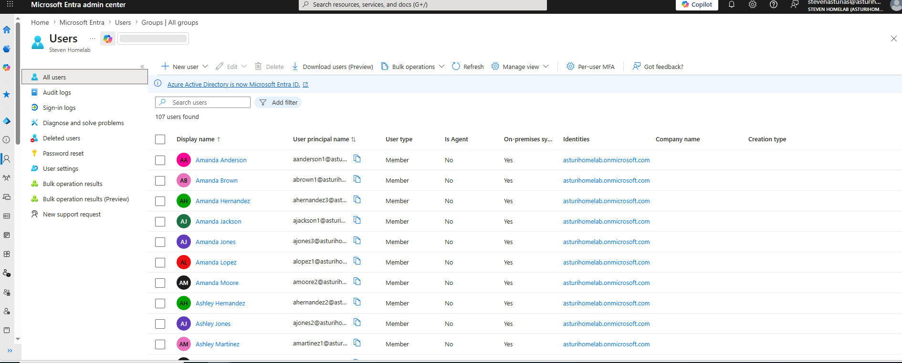
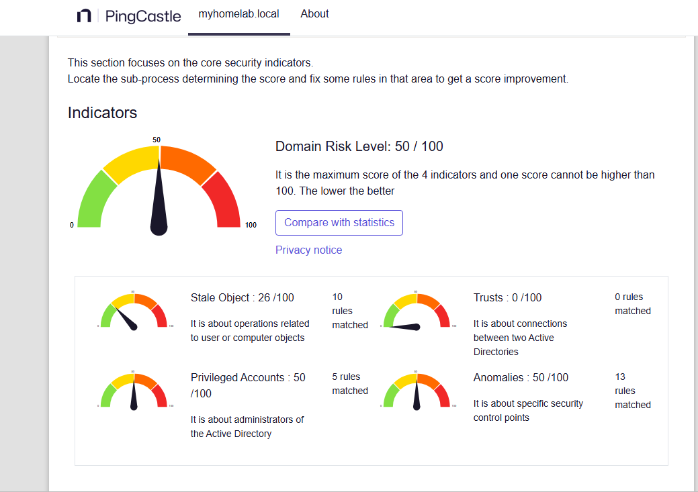
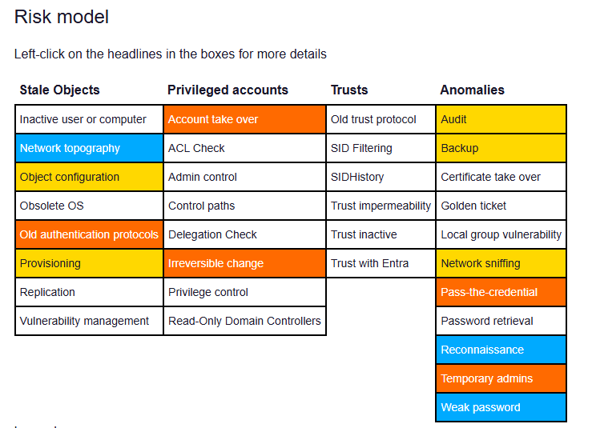
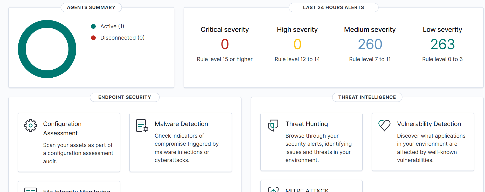
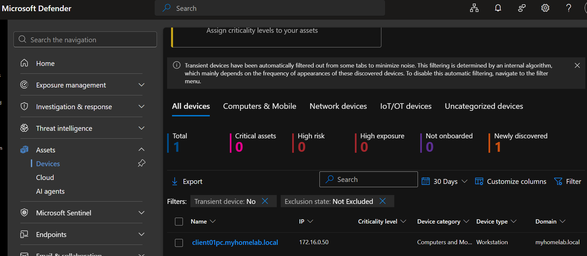

# Hybrid Identity, Offensive Threat Mapping, & SIEM/EDR Integration

## Project Overview
This project represents Phase 2 of my hands-on cybersecurity homelab engineering, building directly upon the foundational Active Directory environment established in Phase 1. This phase elevates the infrastructure to a modern, hardened corporate standard by integrating hybrid cloud identity synchronization, proactive offensive attack path modeling, continuous security auditing, and a dual-layered monitoring framework consisting of a centralized SIEM/XDR and a cloud-managed EDR engine.

The skills exercised throughout this advanced integration phase include:

| Domain | Demonstrated Competency |
| :--- | :--- |
| **Hybrid Cloud Identity** | Microsoft Entra Connect deployment, user/group object directory synchronization |
| **Security Auditing** | Proactive risk baseline assessments, Active Directory structural hardening |
| **Offensive Security** | Graph-theory-based adversarial attack pathfinding, privilege escalation modeling |
| **SIEM & Log Operations** | Linux-based SIEM server administration, endpoint log forwarding architectures |
| **Endpoint Detection & Response** | Enterprise cloud EDR tenant provisioning, behavioral analysis integration |

---

## Hybrid Identity & Threat Surface Mapping

### 1. Microsoft Entra Connect Integration
* **What Was Built:** Deployed and configured Microsoft Entra Connect on the local Domain Controller to establish a directory synchronization pipeline to a Microsoft 365 Business Premium cloud tenant.
* **Why It Matters:** Modern enterprises rarely operate on purely isolated on-premises directory infrastructure. Transitioning the lab to a Hybrid Identity model simulates real-world enterprise constraints, enabling unified identity governance, cloud-based access controls, and preparation for cloud-managed device compliance.



### Auditing via PingCastle
* **What Was Built:** Integrated PingCastle to run automated, deep-dive configuration audits against the Active Directory database structure.
* **Why It Matters:** Organizations frequently suffer from misconfigured AD objects, stale accounts, and weak trust paths. PingCastle establishes an objective security posture baseline score, categorizes risks by severity, and generates an actionable remediation blueprint to proactively harden the domain core before a breach occurs.



### 3. Adversarial Pathfinding via BloodHound CE
* **What Was Built:** Deployed BloodHound Community Edition to extract, ingest, and analyze Active Directory structural data using graph-theory attack mapping.
* **Why It Matters:** Attackers do not think in lists; they think in graphs. By utilizing BloodHound, the environment can be audited from a purely adversarial perspective, revealing hidden privilege escalation routes, nested security group vulnerability paths, and critical asset exposures (e.g., standard endpoint access vectors leading to Domain Admin compromise).


---

## Dual-Layer Centralized Telemetry & SOC Engineering

### 1. Centralized SIEM/XDR (Wazuh Manager Deployment)
* **What Was Built:** Provisioned a dedicated Ubuntu Server VM (Static IP: `192.168.1.165`) hosting the centralized Wazuh SIEM Security Manager cluster and web dashboard interface.
* **Why It Matters:** Security Operations Centers (SOCs) depend on centralized log aggregation to maintain environment visibility. Wazuh serves as the core SIEM/XDR engine, capable of real-time event log parsing, file integrity monitoring (FIM), system vulnerability scanning, and immediate threat correlation.



### 2. Cloud-Managed EDR (Microsoft Defender for Endpoint)
* **What Was Built:** Provisioned an enterprise cloud EDR engine by onboarding endpoint layers directly into Microsoft Defender for Endpoint (MDE).
* **Why It Matters:** Standard event logs can fail to catch advanced in-memory exploits or native living-off-the-land binary attacks. MDE introduces an intelligent cloud behavioral engine capable of tracking process injection, isolating compromised hosts, and executing automated remediation playbook sequences alongside passive SIEM logging.



---

## Technical Troubleshooting Log

### Incident 1: Ubuntu Wazuh Server Storage & Database Crash
* **Context:** The central Ubuntu-based Wazuh server manager experienced an abrupt local storage allocation failure, corrupting index states and rendering the web dashboard user interface entirely inaccessible.
* **Root Cause Diagnostics:** System inspection revealed an unhandled disk constraint, stalling the background database management daemons and causing the web front-end to time out on API calls.
* **Remediation Scripting:** Troubleshot the underlying system service layers, cleared stale local cache locks, purged corrupted indexing remnants, and validated database daemon health to successfully restore the web UI and live log pipeline without core telemetry loss.

### Incident 2: SSL Handshake Failure on Domain Controller Agent Deployment
* **Context:** Attempted to onboard the Windows Server Domain Controller into the active SIEM monitoring framework via a generated PowerShell automated agent installation script. 
* **The Error:** The local agent reported a successful service status (`Running`), but failed to register with the central manager dashboard. Running a diagnostic log pull on the endpoint:
  ```powershell
  Get-Content "C:\Program Files (x86)\ossec-agent\ossec.log" -Tail 20
* Revealed persistent SSL socket drops:
    ```powershell
    ERROR: SSL error (5). Connection refused by the manager. Maybe the port specified is incorrect. Requesting a key from server: 195.168.1.165
    ```
* **Root Cause**: A high-impact syntax error was identified within the initial deployment string: the manager target IP address was misconfigured as an invalid public IP subnet (195.168.1.165) instead of the true internal local server IP (192.168.1.165).
* **Remediation & Administrative Overide**
    1. Bypassed Windows graphical file-type limitations on the .conf extension by executing an elevated administrative terminal override to edit the configuration file natively via Notepad:
    ```powershell
    notepad.exe "C:\Program Files (x86)\ossec-agent\ossec.conf"
    ```
    2. Manually modified the client-server xml configurations to point to the verified internal manager IP space.
    3. Purged stale client registration keys and forced a cold service cycle:
    ```powershell
    Restart-Service -Name WazuhSvc
    ```
    4. Result: Connection successfully verified; the Domain Controller is actively shipping telemetry logs into the SIEM dashboard environment.
    
