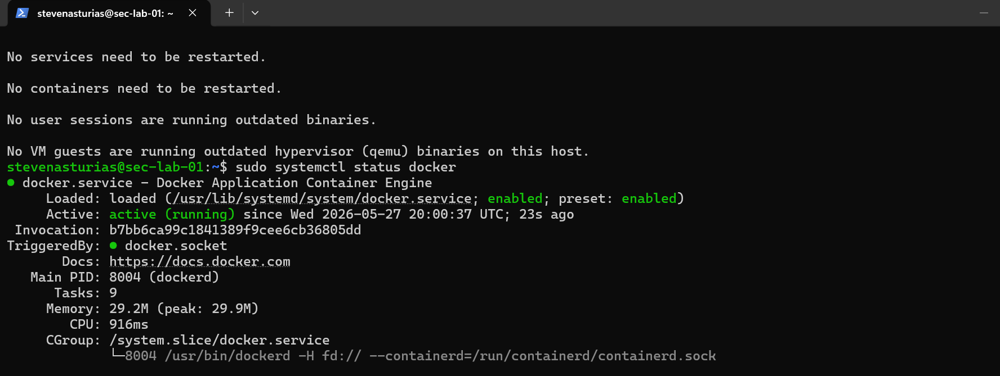
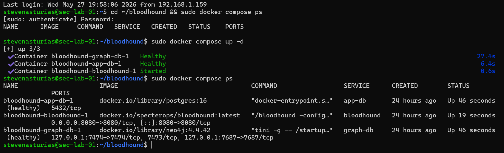
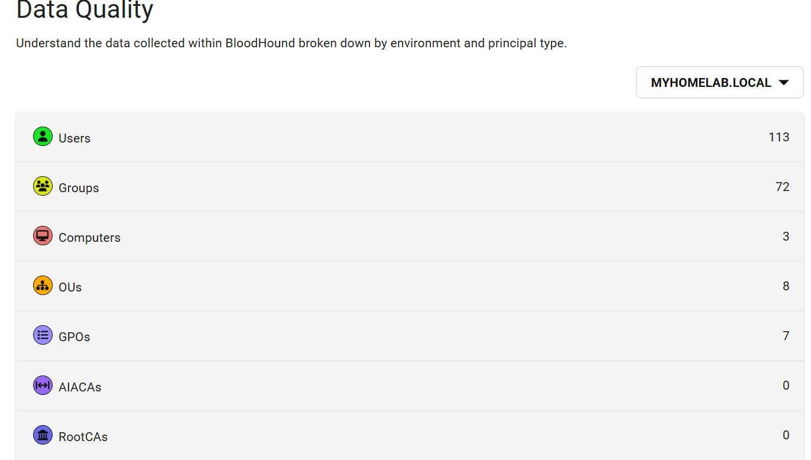
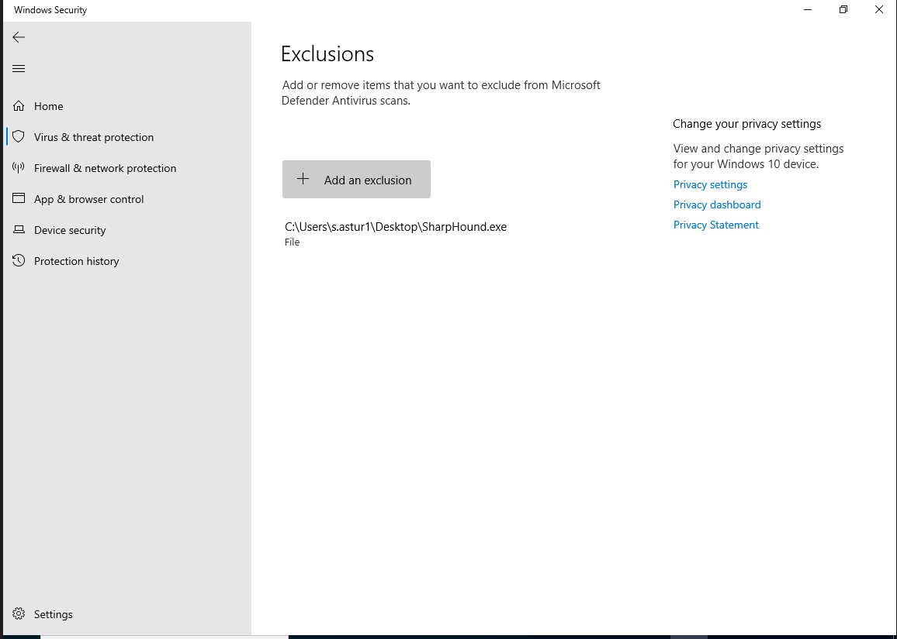

# Cloud Sync & Enterprise Security Lab
This project expands a foundational Active Directory environment into a fully hardened enterprise deployment, adding a SIEM, AD attack path mapping, domain security auditing, and cloud-managed endpoint protection.

The skills exercised throughout this advanced integration phase include:

| Domain | Demonstrated Competency |
| :--- | :--- |
| **Hybrid Cloud Identity** | Microsoft Entra Connect deployment, user/group object directory synchronization |
| **Security Auditing** | Proactive risk baseline assessments, Active Directory structural hardening |
| **Offensive Security** | Graph-theory-based adversarial attack pathfinding, privilege escalation modeling |
| **SIEM & Log Operations** | Linux-based SIEM server administration, endpoint log forwarding architectures |
| **Endpoint Detection & Response** | Enterprise cloud EDR tenant provisioning, behavioral analysis integration |

---

## Hybrid Identity Active Directory Sync to Microsoft Entra ID

### What Was Built
On-premises Active Directory accounts synced to Microsoft Entra ID (formerly Azure AD) using Microsoft Entra Connect, establishing a hybrid identity architecture where the same user accounts exist both locally and in the cloud.

| Component | Details |
| :--- | :--- |
| **Sync Tool** | Microsoft Entra Connect |
| **Source Directory** | `myhomelab.local` (on-premises AD) |
| **Target Directory** | Microsoft Entra ID (Azure AD tenant) |
| **Sync Type** | Password Hash Synchronization |

---

### Why This Matters
Most enterprise environments today are not purely on-premises or purely cloud, they run both at the same time. Every time a user account gets created or changed in your on-premises Active Directory, Entra Connect copies that change up to the cloud so both directories stay in sync. This means a user can log into their domain-joined Windows workstation with the same credentials they use to access Microsoft 365, Azure, or any other cloud service tied to the tenant. That single consistent identity across both environments is called hybrid identity, and it's the standard architecture at most mid-to-large enterprises today.

---

### How I Did It

#### Step A: Prerequisites
1. Confirm the Domain Controller has outbound internet access (required for Entra Connect to reach Microsoft's sync endpoints).
2. Log into the [Azure Portal](https://portal.azure.com) and verify your Entra ID tenant is active under **Microsoft Entra ID > Overview**.
3. Ensure you have a **Global Administrator** account on the Entra ID tenant, because this is required during the Entra Connect setup wizard.

#### Step B: Entra Connect Installation
1. On the Domain Controller, download **Microsoft Entra Connect** from the [Microsoft Download Center](https://www.microsoft.com/en-us/download/details.aspx?id=47594).
2. Run the installer as Administrator.
3. Accept the license terms and click **Continue**.

#### Step C: Express Settings Configuration
1. Select **Custom Settings** — this allows you to configure Password Hash Synchronization, which is the recommended starting point for a lab environment.
2. When prompted, sign in with your **Entra ID Global Administrator** credentials.
3. Next, sign in with your **on-premises AD credentials** (`MYHOMELAB\Administrator`).
4. Entra Connect will discover the `myhomelab.local` forest automatically.
5. Review the configuration summary and click **Install**.

Entra Connect installs, performs an initial sync, and begins running on a 30-minute scheduled cycle from that point forward.

#### Step D: Verification
1. In the **Azure Portal**, navigate to **Microsoft Entra ID > Users**.
2. Confirm that user accounts from `myhomelab.local` are now visible with a source of **Windows Server AD** rather than **Microsoft Entra ID**.
3. On the Domain Controller, open **Synchronization Service Manager** (installed alongside Entra Connect) and verify the last sync operation completed with no errors.

```powershell
# Run on the Domain Controller to manually trigger a sync cycle
Start-ADSyncSyncCycle -PolicyType Delta
```

---

### Verification
Synced accounts appear in the Entra ID Users list with **Source: Windows Server AD**. The Synchronization Service Manager shows a completed sync run with no export errors.


---

## SIEM Deployment, AD Security Auditing & Attack Path Mapping

### What Was Built
A threat detection and security auditing layer built on three tools: Wazuh as the SIEM collecting live logs from the Domain Controller, PingCastle for AD domain risk scoring/security auditing, and BloodHound for visualizing Active Directory attack paths and privilege escalation routes.

| Component | Tool | Host | Purpose |
| :--- | :--- | :--- | :--- |
| **SIEM Manager** | Wazuh & Ubuntu VM| Ubuntu Server `192.168.1.165` | Log ingestion, alerting, agent management |
| **SIEM Agent** | Wazuh Agent | `DomainControllerWIN` | Ships Windows Event Logs to SIEM manager |
| **Domain Auditing** | PingCastle | `DomainControllerWIN` | Risk scoring and misconfiguration detection |
| **Attack Path Mapping** | BloodHound + SharpHound | Ubuntu (BloodHound) / DC (SharpHound) | AD privilege escalation path visualization |

---

### Why This Matters
**Wazuh** acts like a security camera system. The agent on the Domain Controller is the camera, and the Ubuntu SIEM manager is the recording station in a back room. Every interesting event on the DC, a failed login, a new user being created, a service starting unexpectedly, gets shipped to Wazuh and stored for analysis.

**PingCastle** acts like a building inspector walking through your domain and handing you a report card. It doesn't break anything, it tells you what's misconfigured, what's stale, and what an attacker could exploit. Every finding comes with a severity score.

**BloodHound** is the attacker's perspective. It gives an overview of every relationship in Active Directory, such as who's in what group, who has admin rights over what objects, which accounts have a path to Domain Admin; and draws a map. If a low-privileged account can reach Domain Admin in three hops, BloodHound shows you exactly which three hops to take.

---

### 1. Ubuntu Server Provisioning & Docker Setup

### What Was Built
An Ubuntu Server 22.04 VM provisioned in VirtualBox as a dedicated security tooling host, with Docker installed as the container runtime for all subsequent security tool deployments (Wazuh and BloodHound).

| Component | Details |
| :--- | :--- |
| **OS** | Ubuntu Server 22.04 LTS |
| **Network** | Bridged Adapter — `192.168.1.165` (static) |
| **Container Runtime** | Docker Engine |
| **Purpose** | Host platform for Wazuh SIEM and BloodHound containers |

---

### Why This Matters
Docker acts like a lunchbox, instead of cooking a full meal in your kitchen every time (installing a tool directly onto the OS with all its dependencies), you pack everything the tool needs into a self-contained box and just open it when you need it. Each container runs in isolation, meaning Wazuh and BloodHound don't interfere with each other or with the underlying Ubuntu system. This is similar how security teams deploy tools in real environments; containerized, portable, and easy to tear down and rebuild if something breaks.

The Ubuntu VM sitting on a Bridged Adapter also mirrors a real-world out-of-band management network, where the SIEM and security tooling live on a separate network segment from the infrastructure they monitor.

---

### How I Did It

#### Step A: Ubuntu Server VM Provisioning

| Setting | Value |
| :--- | :--- |
| Name | `Sec-Lab-01` |
| OS | Ubuntu Server 22.04 LTS |
| RAM | 4096 MB minimum |
| CPU Cores | 2 |
| Storage | 50 GB dynamically allocated VDI |
| Network | Bridged Adapter |

- Download the **Ubuntu Server 22.04 LTS ISO** from [ubuntu.com](https://ubuntu.com/download/server).
- Attach the ISO in VirtualBox and complete the installation with default settings.
- Set a username and strong password when prompted. No GUI is needed — Ubuntu Server is headless by default.

#### Step B: Static IP Assignment
Assign a static IP so Docker containers and the Wazuh agent on the Domain Controller always have a consistent address to connect to.

```bash
sudo nano /etc/netplan/00-installer-config.yaml
```
```yaml
network:
  ethernets:
    enp0s3:
      dhcp4: no
      addresses: [192.168.1.165/24]
      gateway4: 192.168.1.1
      nameservers:
        addresses: [8.8.8.8, 8.8.4.4]
  version: 2
```
```bash
sudo netplan apply
```

Verify the static IP took effect:
```bash
ip a
```

#### Step C: Docker Engine Installation
```bash
# Update package index
sudo apt update

# Install required dependencies
sudo apt install ca-certificates curl gnupg -y

# Add Docker's official GPG key
sudo install -m 0755 -d /etc/apt/keyrings
curl -fsSL https://download.docker.com/linux/ubuntu/gpg | sudo gpg --dearmor -o /etc/apt/keyrings/docker.gpg
sudo chmod a+r /etc/apt/keyrings/docker.gpg

# Add Docker repository
echo \
  "deb [arch=$(dpkg --print-architecture) signed-by=/etc/apt/keyrings/docker.gpg] \
  https://download.docker.com/linux/ubuntu \
  $(. /etc/os-release && echo "$VERSION_CODENAME") stable" | \
  sudo tee /etc/apt/sources.list.d/docker.list > /dev/null

# Install Docker Engine
sudo apt update
sudo apt install docker-ce docker-ce-cli containerd.io docker-buildx-plugin docker-compose-plugin -y
```

#### Step D: Post-Install Configuration
Add your user to the Docker group so you can run Docker commands without `sudo`:
```bash
sudo usermod -aG docker $USER
newgrp docker
```

#### Step E: Verification
```bash
# Confirm Docker is running
sudo systemctl status docker
```


---

### Confirm
- Ubuntu VM is reachable at `192.168.1.165` from the host machine.
- `docker run hello-world` completes successfully.
- Docker service is set to start on boot (`sudo systemctl enable docker`).

---

### 2. Wazuh Manager Installation & Agent Deployment (Ubuntu & Windows Domain Controller)

1. Create a directory for the Wazuh Docker configuration on Ubuntu VM:
```bash
mkdir wazuh-docker && cd wazuh-docker
```
2. Download the official Wazuh Docker Compose file:
```bash
curl -so docker-compose.yml https://raw.githubusercontent.com/wazuh/wazuh-docker/v4.7.0/single-node/docker-compose.yml
```
3. Deploy the Wazuh stack:
```bash
docker compose up -d
```
This starts three containers: the Wazuh Manager, the Wazuh Indexer, and the Wazuh Dashboard.

4. Once the containers are running, access the Wazuh dashboard at `https://192.168.1.165` in a browser. Default credentials are `admin / SecretPassword` — change these immediately after first login.


#### Wazuh Agent Deployment on AD DC
1. On the Domain Controller, download the **Wazuh Agent for Windows** from the Wazuh dashboard or [packages.wazuh.com](https://packages.wazuh.com).
2. Run the installer and set the **Manager IP** to `192.168.1.165`.
3. Start the agent service:
```powershell
NET START WazuhSvc
```
4. Verify the agent appears as **Active** in the Wazuh dashboard under **Agents**.

The agent immediately begins shipping Windows Event Logs; authentication events, policy changes, and service starts to the SIEM manager.

---

### 2. PingCastleDomain Security Auditing
PingCastle is a portable executable that runs directly on the Domain Controller with no installation required.

1. Download **PingCastle** from [pingcastle.com](https://www.pingcastle.com/download/) and extract it to the Domain Controller.
2. Run `PingCastle.exe` as Administrator.
3. Select **Healthcheck** and enter `myhomelab.local` when prompted.
4. PingCastle crawls the domain and generates an HTML report scoring the environment across four risk categories: **Stale Objects**, **Privileged Accounts**, **Trusts**, and **Anomalies**.
5. View your Risk Model & Risk Assessment reports generated from PingCastle for you DC


The reports highlight specific misconfigurations ranked by severity, giving a concrete remediation checklist. In a real environment this report is used to demonstrate security posture before a penetration test or compliance review.

---

### 3. BloodHound Deployment via Docker

1. Create a directory for BloodHound:
```bash
mkdir bloodhound-docker && cd bloodhound-docker
```
2. Download the official BloodHound Community Edition Docker Compose file:
```bash
curl -L https://ghst.ly/getbhce -o docker-compose.yml
```


3. Deploy BloodHound:
```bash
docker compose up -d
```
4. On first startup, Docker prints a randomly generated password to the container logs. Retrieve it with:
```bash
docker compose logs | grep "Initial Password Set To"
```
5. Before accessing BloodHound UI on the web, confirm that is is running with:
```bash
cd ~/bloodhound && sudo docker compose ps
```


6. Access the BloodHound UI at `http://192.168.1.165:8080` and log in with `admin` and the password from the logs. You will be prompted to set a new password on first login.

**Useful queries to run after import:**
- `Find Shortest Paths to Domain Admins` — shows any route a low-privileged user could take to reach DA
- `Find All Domain Admins` — lists every account with Domain Admin rights
- `Find Principals with DCSync Rights` — identifies accounts that could dump the entire credential database



---


## Cloud Endpoint Protection via Microsoft Defender for Endpoint

### What Was Built
Microsoft Defender for Endpoint (MDE) deployed to the Windows 11 client and managed through the Microsoft 365 Defender portal, onboarded automatically via Group Policy.

| Component | Details |
| :--- | :--- |
| **Portal** | Microsoft 365 Defender (`security.microsoft.com`) |
| **Onboarding Method** | GPO-deployed onboarding package |
| **Protected Endpoint** | `Client01PC` — Windows 11 Enterprise |
| **Capabilities** | EDR, threat and vulnerability management, device inventory |

---

### Why This Matters
MDE is what large enterprises use to protect endpoints when someone can't be watching every machine manually. It watches for suspicious behavior; not just known malware signatures, but patterns like a process trying to read memory from another process, or PowerShell running encoded and obfuscated commands. Everything it sees gets reported to the cloud portal where a security team can investigate and respond.

In an enterprise with thousands of machines, nobody is manually clicking through an installer on each one. You push the onboarding package through Group Policy once, and every machine in scope picks it up automatically on next login.

---

### How I Did It

#### Step A: Microsoft 365 Defender Portal Setup
1. Log into [security.microsoft.com](https://security.microsoft.com) with a Microsoft account that has an active MDE license (a Microsoft 365 E5 trial or Defender for Endpoint Plan 2 trial works).
2. Navigate to **Settings > Endpoints > Onboarding**.
3. Select **Windows 10 and 11** as the OS and **Group Policy** as the deployment method.
4. Download the onboarding package a `.zip` containing an `.admx` policy template and onboarding script.

#### Step B: GPO-Based Onboarding Deployment
1. Extract the onboarding package on the Domain Controller.
2. Copy `WindowsDefenderATP.admx` to:
```
C:\Windows\PolicyDefinitions\
```
3. Copy the corresponding `.adml` language file to:
```
C:\Windows\PolicyDefinitions\en-US\
```
4. In **Group Policy Management Console**, create a new GPO named `MDE-Onboarding` and link it to the OU containing `Client01PC`.
5. Edit the GPO and navigate to:
```
Computer Configuration > Administrative Templates > Windows Components > Microsoft Defender Antivirus > Microsoft Defender for Endpoint
```
6. Enable the **Onboard** setting and paste the onboarding blob from the downloaded script.
7. On the client VM, run `gpupdate /force` to pull the policy immediately.


#### Step C: Verification
```powershell
# Run on the client VM — confirms the MDE sensor is running
Get-Service -Name Sense
```
A status of `Running` confirms the agent is active. In the Microsoft 365 Defender portal, navigate to **Assets > Devices**  `Client01PC` should appear within 5–10 minutes showing its onboarding status, OS details, and risk level.


---

## Technical Troubleshooting Log

### Incident 1: Ubuntu Wazuh Server Storage & Database Crash
* **Context:** The central Ubuntu-based Wazuh server manager experienced an abrupt local storage allocation failure, corrupting index states and rendering the web dashboard user interface entirely inaccessible.
* **Root Cause Diagnostics:** System inspection revealed an unhandled disk constraint, stalling the background database management daemons and causing the web front-end to time out on API calls.
* **Remediation Scripting:** Troubleshot the underlying system service layers, cleared stale local cache locks, purged corrupted indexing remnants, and validated database daemon health to successfully restore the web UI and live log pipeline without core telemetry loss.
1. Safely cleared localized package caching and pruned stale operational temp files to liberate storage space on the partition.
2. Deleted corrupted file locks left behind by the indexer crash:
```bash 
sudo rm -rf /var/ossec/var/run/*
```
3. Forced a hard cycle of the indexing cluster to validate database daemon health:
```bash
sudo systemctl restart wazuh-indexer
sudo systemctl restart wazuh-manager
sudo systemctl restart wazuh-dashboard
```
4. Result: Verified all processes successfully binded back to their active ports. The web interface recovered smoothly with zero core log telemetry data loss.


### Incident 2: SSL Handshake Failure on Domain Controller Agent Deployment
* **Context:** Attempted to onboard the Windows Server Domain Controller into the active SIEM monitoring framework via a generated PowerShell automated agent installation script. 
* **The Error:** The local agent reported a successful service status (`Running`), but failed to register with the central manager dashboard. Running a diagnostic log pull on the endpoint:
  ```powershell
  Get-Content "C:\Program Files (x86)\ossec-agent\ossec.log" -Tail 20
* Revealed persistent SSL socket drops:
    ```powershell
    ERROR: SSL error (5). Connection refused by the manager. Maybe the port specified is incorrect. Requesting a key from server: 195.168.1.165
    ```
* **Root Cause**: A high-impact syntax error was identified within the initial deployment string: the manager target IP address was misconfigured as an invalid public IP subnet (195.168.1.165) instead of the true internal local server IP (192.168.1.165).
* **Remediation & Administrative Overide**
    1. Bypassed Windows graphical file-type limitations on the .conf extension by executing an elevated administrative terminal override to edit the configuration file natively via Notepad:
    ```powershell
    notepad.exe "C:\Program Files (x86)\ossec-agent\ossec.conf"
    ```
    2. Manually modified the client-server xml configurations to point to the verified internal manager IP space.
    3. Purged stale client registration keys and forced a cold service cycle:
    ```powershell
    Restart-Service -Name WazuhSvc
    ```
    4. Result: Connection successfully verified; the Domain Controller is actively shipping telemetry logs into the SIEM dashboard environment.
    

    
### Incident 3: SharpHound Blocked by Windows Defender

* **Context:** Running `SharpHound.exe` on the Domain Controller was immediately blocked by Windows Security. The executable was flagged as a potentially unwanted application and prevented from executing, producing no output.

* **Root Cause:** SharpHound is a legitimate Active Directory enumeration tool used by security professionals, but because it is also widely used in real attacks to map privilege escalation paths, Windows Defender flags it as a hack tool by default. This is expected behavior and not a sign that something is wrong with the file.

* **Fix:** Added a Windows Defender exclusion for the folder containing `SharpHound.exe` so real-time protection would not interfere with execution.

1. Open **Windows Security** on the Domain Controller.
2. Navigate to **Virus & Threat Protection > Manage Settings**.
3. Scroll down to **Exclusions** and click **Add or remove exclusions**.
4. Click **Add an exclusion > Folder** and select the directory containing `SharpHound.exe`.
5. Re-ran `SharpHound.exe` after the exclusion was applied, completed successfully and generated the output ZIP file.

> **Note:** This exclusion should only exist for the duration of the data collection exercise. In a real environment, running SharpHound without authorization would itself be a security incident. The Wazuh agent on the Domain Controller would log this activity, making it a useful detection exercise to revisit in a future phase.

---

## Conclusion

This lab goes from a blank hypervisor to a monitored, audited, and actively protected enterprise environment across five phases. The design was proceeded with the intention to mirror how real IT and security teams layer defenses: build the infrastructure, automate identity management, lock it down with policy, then add visibility and detection on top. 


| Domain | Key Technologies |
| :--- | :--- |
| Infrastructure | VirtualBox, Windows Server 2022, RRAS, DHCP, DNS |
| Identity Automation | PowerShell, AD DS, OU taxonomy, RBAC |
| Policy Enforcement | GPO, AppLocker, Item-Level Targeting |
| Threat Detection & Auditing | Wazuh, PingCastle, BloodHound, SharpHound |
| Endpoint Protection | Microsoft Defender for Endpoint, GPO onboarding |
