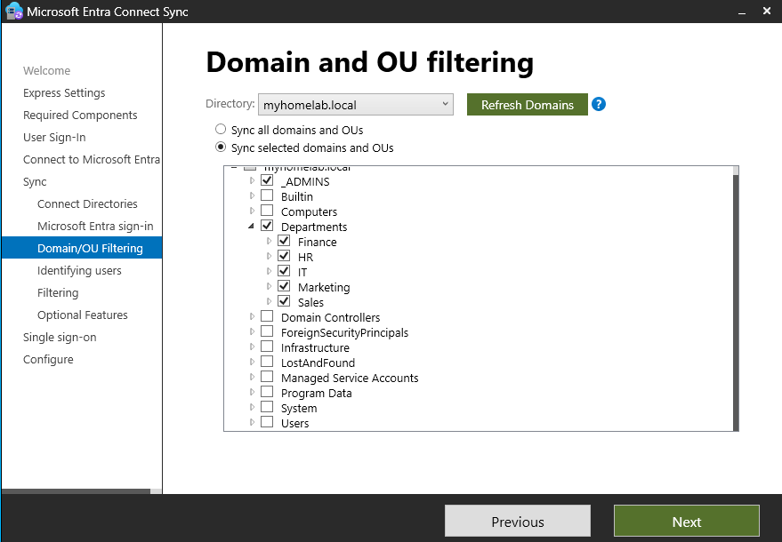
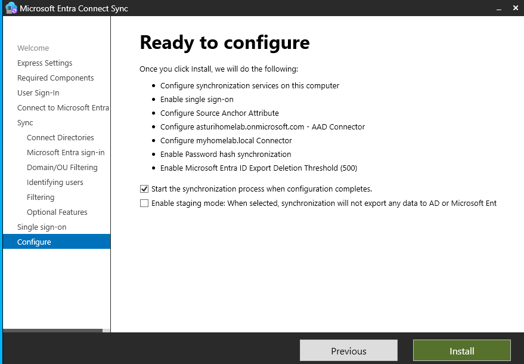
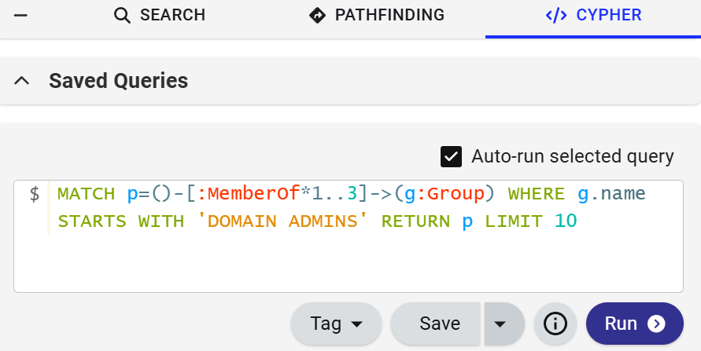
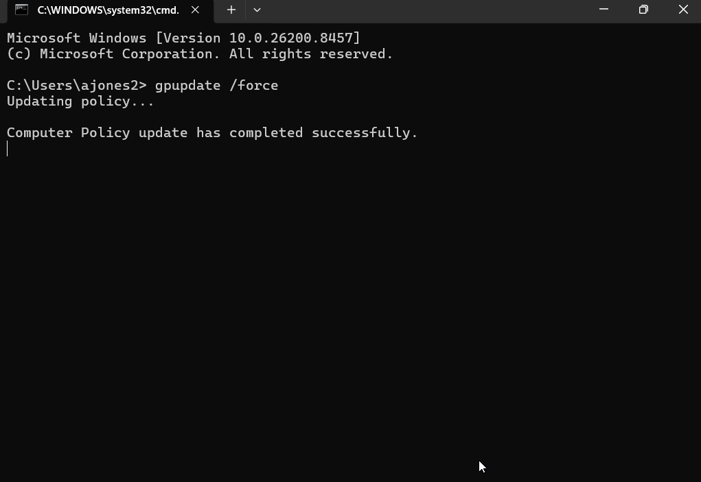
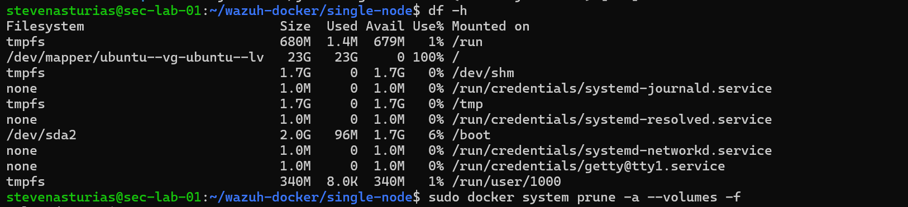
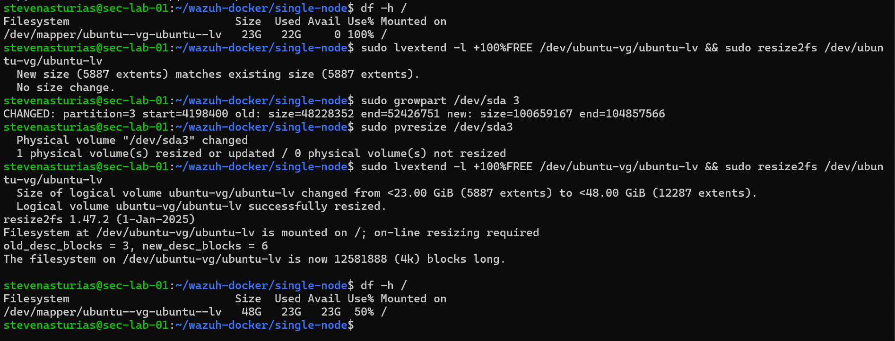

# Cloud Sync & Enterprise Security Lab
This project expands a foundational Active Directory environment into a fully hardened enterprise deployment, adding a SIEM, AD attack path mapping, domain security auditing, and cloud-managed endpoint protection.

The skills exercised throughout this advanced integration phase include:

| Domain | Demonstrated Competency |
| :--- | :--- |
| **Hybrid Cloud Identity** | Microsoft Entra Connect deployment, user/group object directory synchronization |
| **Security Auditing** | Proactive risk baseline assessments, Active Directory structural hardening |
| **Offensive Security** | Graph-theory-based adversarial attack pathfinding, privilege escalation modeling |
| **SIEM & Log Operations** | Linux-based SIEM server administration, endpoint log forwarding architectures |
| **Endpoint Detection & Response** | Enterprise cloud EDR tenant provisioning, behavioral analysis integration |

---

## Hybrid Identity Active Directory Sync to Microsoft Entra ID

### What Was Built
On-premises Active Directory accounts synced to Microsoft Entra ID (formerly Azure AD) using Microsoft Entra Connect, establishing a hybrid identity architecture where the same user accounts exist both locally and in the cloud.

| Component | Details |
| :--- | :--- |
| **Sync Tool** | Microsoft Entra Connect |
| **Source Directory** | `myhomelab.local` (on-premises AD) |
| **Target Directory** | Microsoft Entra ID (Azure AD tenant) |
| **Sync Type** | Password Hash Synchronization |

---

### Why This Matters
Most enterprise environments today are not purely on-premises or purely cloud, they run both at the same time. Entra Connect is like a copy machine that runs on a schedule. Every time a user account gets created or changed in your on-premises Active Directory, Entra Connect copies that change up to the cloud so both directories stay in sync. This means a user can log into their domain-joined Windows workstation with the same credentials they use to access Microsoft 365, Azure, or any other cloud service tied to the tenant. That single consistent identity across both environments is called hybrid identity, and it's the standard architecture at most mid-to-large enterprises today.

---

### How I Did It

#### Step A: Prerequisites
1. Confirm the Domain Controller has outbound internet access (required for Entra Connect to reach Microsoft's sync endpoints).
2. Log into the [Azure Portal](https://portal.azure.com) and verify your Entra ID tenant is active under **Microsoft Entra ID > Overview**.
3. Ensure you have a **Global Administrator** account on the Entra ID tenant, because this is required during the Entra Connect setup wizard.

#### Step B: Entra Connect Installation
1. On the Domain Controller, download **Microsoft Entra Connect** from the [Microsoft Download Center](https://www.microsoft.com/en-us/download/details.aspx?id=47594).
2. Run the installer as Administrator.
3. Accept the license terms and click **Continue**.

#### Step C: Express Settings Configuration
1. Select **Use express settings** — this configures Password Hash Synchronization automatically, which is the recommended starting point for a lab environment.
2. When prompted, sign in with your **Entra ID Global Administrator** credentials.
3. Next, sign in with your **on-premises AD credentials** (`MYHOMELAB\Administrator`).
4. Entra Connect will discover the `myhomelab.local` forest automatically.
5. Review the configuration summary and click **Install**.

Entra Connect installs, performs an initial sync, and begins running on a 30-minute scheduled cycle from that point forward.

#### Step D: Verification
1. In the **Azure Portal**, navigate to **Microsoft Entra ID > Users**.
2. Confirm that user accounts from `myhomelab.local` are now visible with a source of **Windows Server AD** rather than **Microsoft Entra ID**.
3. On the Domain Controller, open **Synchronization Service Manager** (installed alongside Entra Connect) and verify the last sync operation completed with no errors.

```powershell
# Run on the Domain Controller to manually trigger a sync cycle
Start-ADSyncSyncCycle -PolicyType Delta
```

---

### Verification
Synced accounts appear in the Entra ID Users list with **Source: Windows Server AD**. The Synchronization Service Manager shows a completed sync run with no export errors.





---

## SIEM Deployment, AD Security Auditing & Attack Path Mapping

### What Was Built
A threat detection and security auditing layer built on three tools: Wazuh as the SIEM collecting live logs from the Domain Controller, PingCastle for AD domain risk scoring, and BloodHound for visualizing Active Directory attack paths and privilege escalation routes.

| Component | Tool | Host | Purpose |
| :--- | :--- | :--- | :--- |
| **SIEM Manager** | Wazuh | Ubuntu Server `192.168.1.165` | Log ingestion, alerting, agent management |
| **SIEM Agent** | Wazuh Agent | `DomainControllerWIN` | Ships Windows Event Logs to SIEM manager |
| **Domain Auditing** | PingCastle | `DomainControllerWIN` | Risk scoring and misconfiguration detection |
| **Attack Path Mapping** | BloodHound + SharpHound | Ubuntu (BloodHound) / DC (SharpHound) | AD privilege escalation path visualization |

---

### Why This Matters
Building a secured AD environment is one thing. Knowing whether it's actually secure and seeing attacks as they happen is a completely different problem. This phase adds eyes to the lab.

Think of **Wazuh** like a security camera system. The agent on the Domain Controller is the camera, and the Ubuntu SIEM manager is the recording station in a back room. Every interesting event on the DC, a failed login, a new user being created, a service starting unexpectedly, gets shipped to Wazuh and stored for analysis.

**PingCastle** is like a building inspector walking through your domain and handing you a report card. It doesn't break anything, it tells you what's misconfigured, what's stale, and what an attacker could exploit. Every finding comes with a severity score.

**BloodHound** is the attacker's perspective. It takes a snapshot of every relationship in Active Directory — who's in what group, who has admin rights over what objects, which accounts have a path to Domain Admin; and draws a map. If a low-privileged account can reach Domain Admin in three hops, BloodHound shows you exactly which three hops to take.


### How I Did It

#### Step A: Ubuntu Server VM Provisioning

| Setting | Value |
| :--- | :--- |
| Name | `WazuhSIEM` |
| OS | Ubuntu Server 22.04 LTS |
| RAM | 4096 MB minimum |
| CPU Cores | 2 |
| Storage | 50 GB dynamically allocated VDI |
| Network | Bridged Adapter |

After installation, assign a static IP so the Wazuh agent always knows where to reach the manager:
```bash
sudo nano /etc/netplan/00-installer-config.yaml
```
```yaml
network:
  ethernets:
    enp0s3:
      dhcp4: no
      addresses: [192.168.1.165/24]
      gateway4: 192.168.1.1
      nameservers:
        addresses: [8.8.8.8, 8.8.4.4]
  version: 2
```
```bash
sudo netplan apply
```

#### Step B: Wazuh Manager Installation (Ubuntu)
```bash
curl -sO https://packages.wazuh.com/4.7/wazuh-install.sh
sudo bash wazuh-install.sh -a
```
Once complete, the Wazuh dashboard is accessible at `https://192.168.1.165`. Log in with the credentials output by the installer.

#### Step C: Wazuh Agent Deployment (Domain Controller)
1. On the Domain Controller, download the **Wazuh Agent for Windows** from the Wazuh dashboard or [packages.wazuh.com](https://packages.wazuh.com).
2. Run the installer and set the **Manager IP** to `192.168.1.165`.
3. Start the agent service:
```powershell
NET START WazuhSvc
```
4. Verify the agent appears as **Active** in the Wazuh dashboard under **Agents**.

The agent immediately begins shipping Windows Event Logs — authentication events, policy changes, service starts, and more — to the SIEM manager.

#### Step D: PingCastle — Domain Security Audit
PingCastle is a portable executable that runs directly on the Domain Controller with no installation required.

1. Download **PingCastle** from [pingcastle.com](https://www.pingcastle.com/download/) and extract it to the Domain Controller.
2. Run `PingCastle.exe` as Administrator.
3. Select **1 — Healthcheck** and enter `myhomelab.local` when prompted.
4. PingCastle crawls the domain and generates an HTML report scoring the environment across four risk categories: **Stale Objects**, **Privileged Accounts**, **Trusts**, and **Anomalies**.

The report highlights specific misconfigurations ranked by severity, giving a concrete remediation checklist. In a real environment this report is used to demonstrate security posture before a penetration test or compliance review.

#### Step E: BloodHound — Attack Path Mapping

**On the Domain Controller — SharpHound data collection:**

SharpHound queries Active Directory and exports a ZIP file containing all the relationship data BloodHound needs to build its graph.

1. Download **SharpHound** from the [BloodHound GitHub releases](https://github.com/BloodHoundAD/BloodHound/releases).
2. Run it on the Domain Controller:
```powershell
.\SharpHound.exe -c All
```
3. Transfer the output `.zip` file to the Ubuntu VM.

**On Ubuntu — BloodHound installation and data import:**
```bash
sudo apt install bloodhound neo4j -y
sudo neo4j start
bloodhound &
```
1. On first launch, change the default Neo4j password at `http://localhost:7474`.
2. Log into the BloodHound GUI and click **Upload Data**. Select the SharpHound ZIP file.
3. BloodHound ingests the data and builds an interactive graph of the entire AD environment.

**Useful queries to run after import:**
- `Find Shortest Paths to Domain Admins` — shows any route a low-privileged user could take to reach DA
- `Find All Domain Admins` — lists every account with Domain Admin rights
- `Find Principals with DCSync Rights` — identifies accounts that could dump the entire credential database

---

### Verification
- Wazuh dashboard shows `DomainControllerWIN` agent as **Active** with events populating in real time.

- PingCastle HTML report generated with a domain risk score and itemized findings.


- BloodHound graph loaded and attack path queries return results.



## Cloud Endpoint Protection via Microsoft Defender for Endpoint

### What Was Built
Microsoft Defender for Endpoint (MDE) deployed to the Windows 11 client and managed through the Microsoft 365 Defender portal, onboarded automatically via Group Policy.

| Component | Details |
| :--- | :--- |
| **Portal** | Microsoft 365 Defender (`security.microsoft.com`) |
| **Onboarding Method** | GPO-deployed onboarding package |
| **Protected Endpoint** | `Client01PC` — Windows 11 Enterprise |
| **Capabilities** | EDR, threat and vulnerability management, device inventory |

---

### Why This Matters
MDE is what large enterprises use to protect endpoints when someone can't be watching every machine manually. It watches for suspicious behavior; not just known malware signatures, but patterns like a process trying to read memory from another process, or PowerShell running encoded and obfuscated commands. Everything it sees gets reported to the cloud portal where a security team can investigate and respond.

In an enterprise with thousands of machines, nobody is manually clicking through an installer on each one. You push the onboarding package through Group Policy once, and every machine in scope picks it up automatically on next login.

---

### How I Did It

#### Step A: Microsoft 365 Defender Portal Setup
1. Log into [security.microsoft.com](https://security.microsoft.com) with a Microsoft account that has an active MDE license (a Microsoft 365 E5 trial or Defender for Endpoint Plan 2 trial works).
2. Navigate to **Settings > Endpoints > Onboarding**.
3. Select **Windows 10 and 11** as the OS and **Group Policy** as the deployment method.
4. Download the onboarding package a `.zip` containing an `.admx` policy template and onboarding script.

#### Step B: GPO-Based Onboarding Deployment
1. Extract the onboarding package on the Domain Controller.
2. Copy `WindowsDefenderATP.admx` to:
```
C:\Windows\PolicyDefinitions\
```
3. Copy the corresponding `.adml` language file to:
```
C:\Windows\PolicyDefinitions\en-US\
```
4. In **Group Policy Management Console**, create a new GPO named `MDE-Onboarding` and link it to the OU containing `Client01PC`.
5. Edit the GPO and navigate to:
```
Computer Configuration > Administrative Templates > Windows Components > Microsoft Defender Antivirus > Microsoft Defender for Endpoint
```
6. Enable the **Onboard** setting and paste the onboarding blob from the downloaded script.
7. On the client VM, run `gpupdate /force` to pull the policy immediately.


#### Step C: Verification
```powershell
# Run on the client VM — confirms the MDE sensor is running
Get-Service -Name Sense
```
A status of `Running` confirms the agent is active. In the Microsoft 365 Defender portal, navigate to **Assets > Devices**  `Client01PC` should appear within 5–10 minutes showing its onboarding status, OS details, and risk level.


---

## Technical Troubleshooting Log

### Incident 1: Ubuntu Wazuh Server Storage & Database Crash
* **Context:** The central Ubuntu-based Wazuh server manager experienced an abrupt local storage allocation failure, corrupting index states and rendering the web dashboard user interface entirely inaccessible.
* **Root Cause Diagnostics:** System inspection revealed an unhandled disk constraint, stalling the background database management daemons and causing the web front-end to time out on API calls.
* **Remediation Scripting:** Troubleshot the underlying system service layers, cleared stale local cache locks, purged corrupted indexing remnants, and validated database daemon health to successfully restore the web UI and live log pipeline without core telemetry loss.
1. Safely cleared localized package caching and pruned stale operational temp files to liberate storage space on the partition.
2. Deleted corrupted file locks left behind by the indexer crash:
```bash 
sudo rm -rf /var/ossec/var/run/*
```
3. Forced a hard cycle of the indexing cluster to validate database daemon health:
```bash
sudo systemctl restart wazuh-indexer
sudo systemctl restart wazuh-manager
sudo systemctl restart wazuh-dashboard
```
4. Result: Verified all processes successfully binded back to their active ports. The web interface recovered smoothly with zero core log telemetry data loss.




### Incident 2: SSL Handshake Failure on Domain Controller Agent Deployment
* **Context:** Attempted to onboard the Windows Server Domain Controller into the active SIEM monitoring framework via a generated PowerShell automated agent installation script. 
* **The Error:** The local agent reported a successful service status (`Running`), but failed to register with the central manager dashboard. Running a diagnostic log pull on the endpoint:
  ```powershell
  Get-Content "C:\Program Files (x86)\ossec-agent\ossec.log" -Tail 20
* Revealed persistent SSL socket drops:
    ```powershell
    ERROR: SSL error (5). Connection refused by the manager. Maybe the port specified is incorrect. Requesting a key from server: 195.168.1.165
    ```
* **Root Cause**: A high-impact syntax error was identified within the initial deployment string: the manager target IP address was misconfigured as an invalid public IP subnet (195.168.1.165) instead of the true internal local server IP (192.168.1.165).
* **Remediation & Administrative Overide**
    1. Bypassed Windows graphical file-type limitations on the .conf extension by executing an elevated administrative terminal override to edit the configuration file natively via Notepad:
    ```powershell
    notepad.exe "C:\Program Files (x86)\ossec-agent\ossec.conf"
    ```
    2. Manually modified the client-server xml configurations to point to the verified internal manager IP space.
    3. Purged stale client registration keys and forced a cold service cycle:
    ```powershell
    Restart-Service -Name WazuhSvc
    ```
    4. Result: Connection successfully verified; the Domain Controller is actively shipping telemetry logs into the SIEM dashboard environment.
    

---

## Conclusion

This lab goes from a blank hypervisor to a monitored, audited, and actively protected enterprise environment across five phases. The progression mirrors how real IT and security teams layer defenses: build the infrastructure, automate identity management, lock it down with policy, then add visibility and detection on top.

The most instructive moments weren't the steps that worked the first time. AppLocker silently breaking the Start Menu, the DHCP gateway missing because Scope Option 003 was never configured, ILT failing because of a missing Read permission on a GPO — those are the problems that show up in real environments too. Documenting them is the point.

| Phase | Domain | Key Technologies |
| :--- | :--- | :--- |
| 0–1 | Infrastructure | VirtualBox, Windows Server 2022, RRAS, DHCP, DNS |
| 2 | Identity Automation | PowerShell, AD DS, OU taxonomy, RBAC |
| 3 | Policy Enforcement | GPO, AppLocker, Item-Level Targeting |
| 4 | Threat Detection & Auditing | Wazuh, PingCastle, BloodHound, SharpHound |
| 5 | Endpoint Protection | Microsoft Defender for Endpoint, GPO onboarding |
